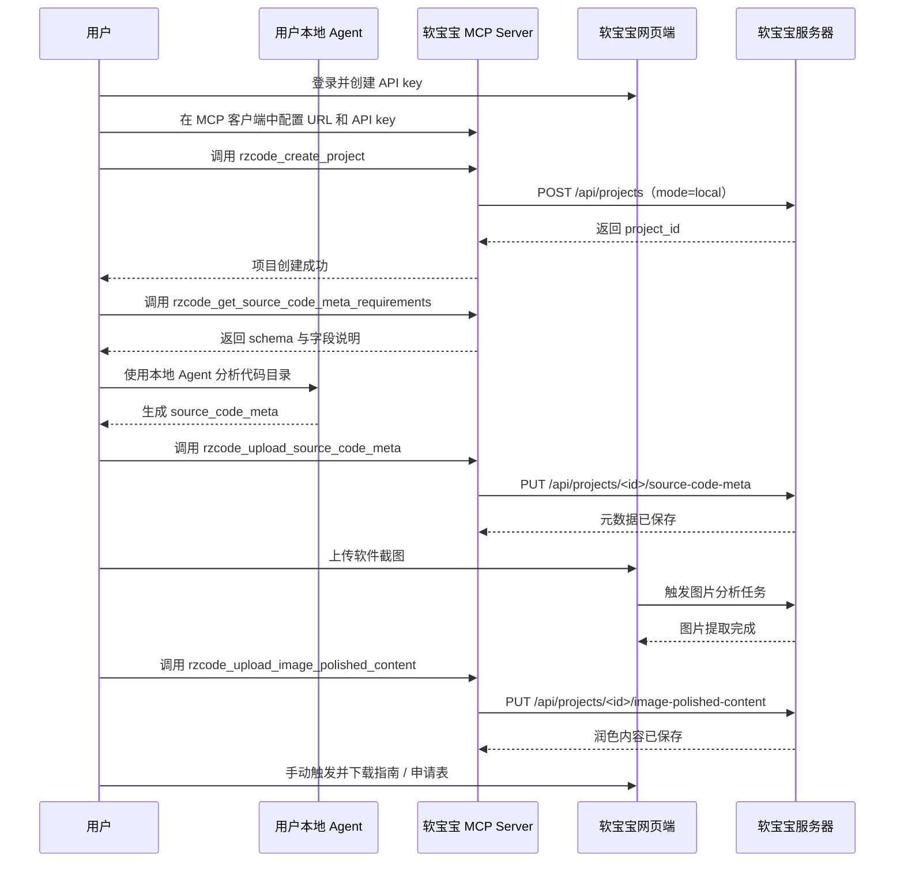
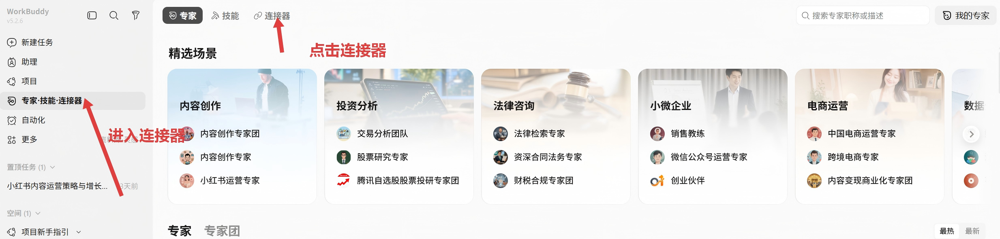
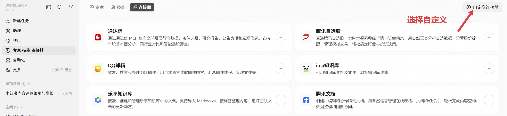
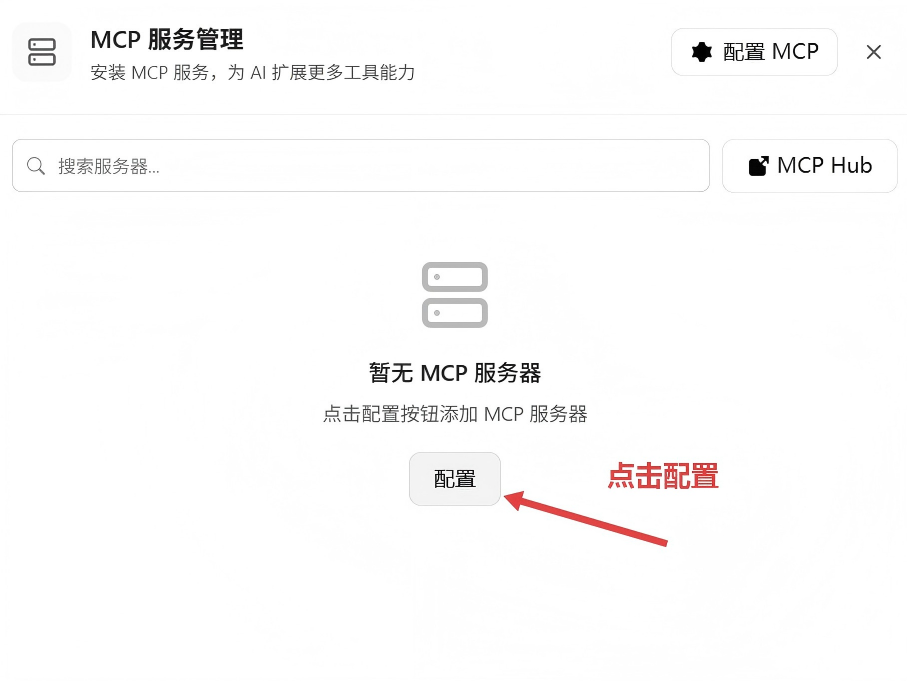
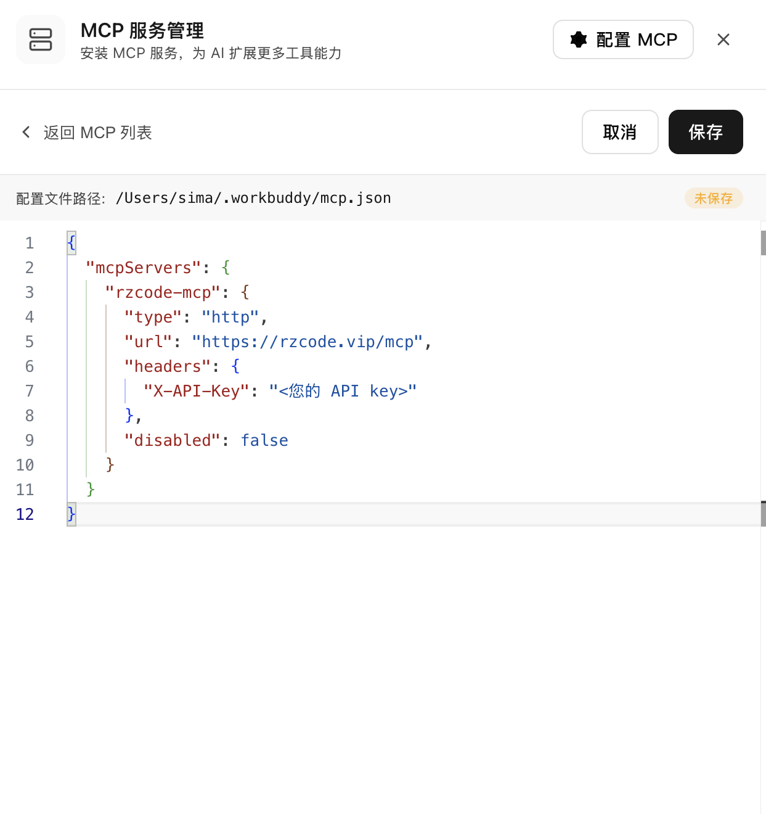
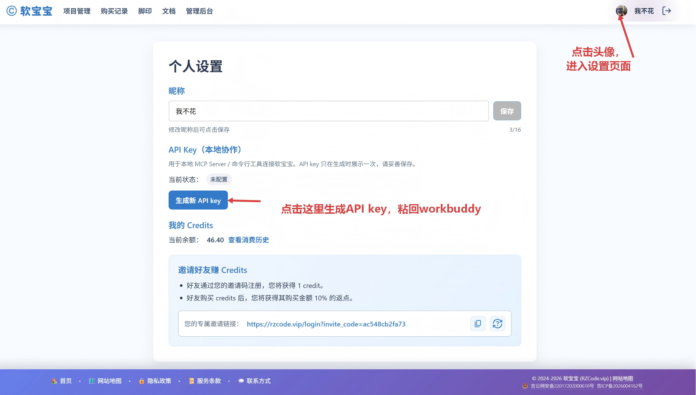
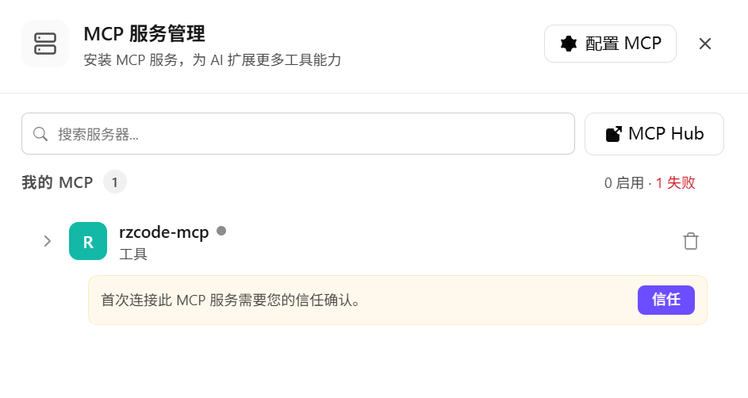
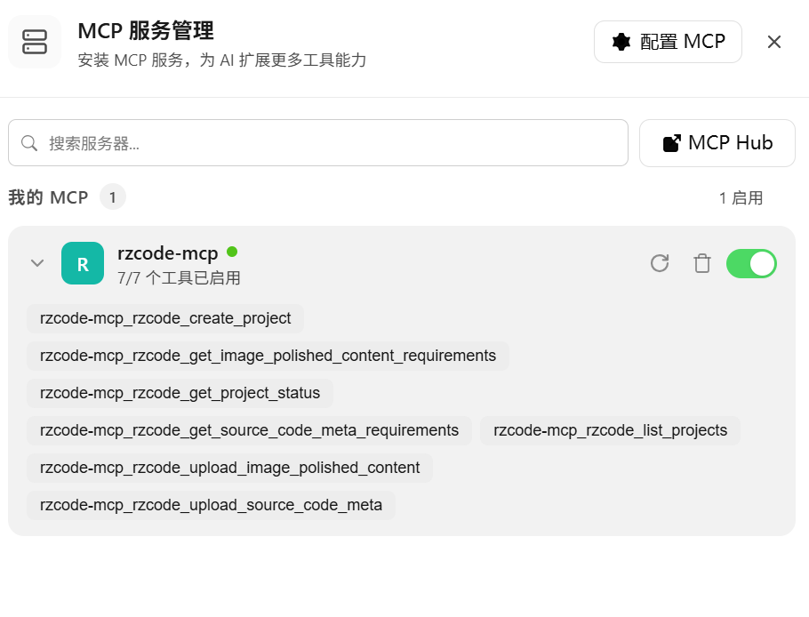
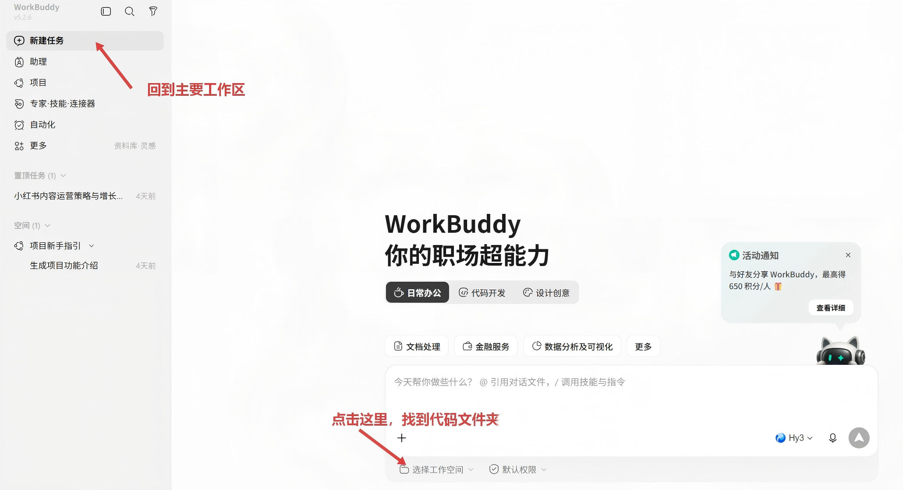

# 本地协作模式：源代码不离开本地也能申请软著

如果您担心把项目源代码上传到第三方服务器，软宝宝提供了**本地协作模式**。在此模式下，源代码的分析过程完全在您的本地设备上完成，您只需要把分析后的结构化数据上传到软宝宝，即可继续生成软著申请所需的指南、申请表等材料。

## 什么是本地协作模式？

本地协作模式是软宝宝为注重代码隐私的用户设计的一种工作方式。它的核心思路是：

- **源代码不离开本地**：您本地的 Agent 直接读取项目代码，完成代码结构、模块关系、功能说明等分析。
- **只上传结构化分析结果**：本地 Agent 输出的是 `source_code_meta` 这类结构化数据，而不是原始代码文件。
- **图片处理由网页端完成**：软件截图、运行界面等图片可在软宝宝网页端上传，由服务器分析并润色。
- **文档生成仍在软宝宝完成**：结合本地分析结果和图片分析结果，一键生成符合软著申请要求的 Word 文档。

这样既保留了软宝宝自动化生成材料的能力，又把最敏感的数据留在了您的本地。

## 适合哪些场景？

本地协作模式特别适合以下情况：

- 项目代码涉及商业机密或核心技术，不方便外传。
- 公司或团队对代码上传有合规要求。
- 项目包含敏感数据、隐私相关模块，希望最小化上传内容。
- 您已经在本地使用 LLM 或 MCP 客户端，希望把软宝宝接入现有工作流。

## 工作流程概览



## 网页端 vs. MCP 工具：操作分工

| 操作                 | 在哪里完成       | 说明                                                          |
| -------------------- | ---------------- | ------------------------------------------------------------- |
| 获取 API key         | 软宝宝网页端     | 在「设置」页面生成并复制。                                    |
| 创建本地项目         | MCP 工具或网页端 | 调用 `rzcode_create_project`，模式为 `local`。                |
| 查看代码分析字段要求 | MCP 工具         | 调用 `rzcode_get_source_code_meta_requirements` 获取 schema。 |
| 分析本地代码         | 用户本地 Agent   | 读取代码目录，按 schema 输出 `source_code_meta`。             |
| 上传代码分析结果     | MCP 工具         | 调用 `rzcode_upload_source_code_meta`。                       |
| 上传软件截图         | 软宝宝网页端     | 直接拖拽或选择图片上传。                                      |
| 上传图片润色结果     | MCP 工具         | 调用 `rzcode_upload_image_polished_content`。                 |
| 生成并下载文档       | 软宝宝网页端     | 手动触发「生成指南」或「生成申请表」。                        |

## 前置准备

开始之前，请确保您已完成以下准备：

1. 注册并登录软宝宝账号。
2. 在软宝宝网页端「设置」中生成 API key，并妥善保存。
3. 在本地安装支持 MCP 的客户端，例如 WorkBuddy、Claude Desktop、Cursor 等。下文以 WorkBuddy 为例说明配置步骤。

## 安装并使用软宝宝 Skill（推荐）

软宝宝 Skill 是本地协作模式的推荐使用方式，安装后只需一条命令即可自动完成代码分析、材料整理与文档生成。

### 方法一：通过 SkillHub 安装

访问 [SkillHub - rzcode-workflow-skill](https://skillhub.cn/skills/rzcode-workflow-skill) 完成安装。

### 方法二：通过 Red Skill 商店安装

复制并发送以下提示词给你的 Agent：

```text
现在为你安装Skill，先来检查是否已安装Red Skill商店，请根据 https://redskill.xiaohongshu.net/install.md 安装RedSkill 商店，然后安装rzcode-workflow-skill技能。若已安装，则直接安装 rzcode-workflow-skill 技能。
```

### 使用方法

Skill 安装完成后，在对话框中输入：

```text
/rzcode-workflow-skill 生成 全部 / 源代码 / 使用说明 / 申请帮助 文档
```

其中末尾参数用于指定要生成的文档类型，可替换为：

- `全部`：一次性生成源代码、使用说明与申请帮助文档
- `源代码`：仅生成源代码相关说明
- `使用说明`：仅生成软件使用说明
- `申请帮助`：仅生成申请辅助文档

## 备选方案：手动配置 MCP

如果你无法使用软宝宝 Skill，也可以直接在支持 MCP 的客户端中手动配置软宝宝 MCP Server。下文以 WorkBuddy 为例说明配置步骤。

### 第一步：添加 MCP 配置






在 WorkBuddy 中找到「自定义连接器」，点击「配置 MCP」。如果配置文件为空，直接粘贴以下内容；如果已有 `mcpServers` 字段，请将 `rzcode-mcp` 那一段合并进去。

```json
{
  "mcpServers": {
    "rzcode-mcp": {
      "type": "http",
      "url": "https://rzcode.vip/mcp",
      "protocolVersion": "0.6.1",
      "headers": {
        "X-API-Key": "<您的 API key>"
      }
    }
  }
}
```

> **说明：** `<您的 API key>` 需要替换为您从软宝宝网页端「设置」中生成的实际 API key。

保存后返回「MCP 服务管理」页面。

### 第二步：如何找到X-API-Key

1. 打开软宝宝设置页面
   
2. 点击生成API key, 然后将key粘贴回workbuddy的mcp配置里。

### 第三步：启用并信任 MCP



在「MCP 服务管理」的「我的 MCP」列表中，找到 `rzcode-mcp`。首次连接前，WorkBuddy 会提示您「信任」该服务，点击确认。

连接成功后，您可以看到软宝宝 MCP 提供的工具，例如：

- `rzcode_create_project`
- `rzcode_list_projects`
- `rzcode_get_source_code_meta_requirements`
- `rzcode_upload_source_code_meta`
- `rzcode_upload_image_polished_content`



### 第四步：选择本地代码目录

进入工作区间

在 WorkBuddy 新建任务时，点击「选择工作空间」，然后选择您要申请软著的项目代码所在文件夹。后续本地 Agent 将读取该目录进行分析。

### 第五步：使用 MCP 工具

配置完成后，您可以在支持 MCP 的 Agent 中直接调用软宝宝 MCP 工具。典型流程为：创建本地项目 → 获取代码元数据要求 → 在本地分析代码并生成 `source_code_meta` → 上传代码元数据 → 上传图片润色内容 → 在软宝宝网页端生成并下载文档。

### 测试 MCP 连接

配置完成后，可以用自然语言测试工具是否正常可用：

```text
/rzcode-workflow-skill 列出我的软宝宝项目

或

/rzcode_list_projects 列出我的软宝宝项目
```

或

```text
使用 rzcode-mcp 帮我创建一个新的本地协作项目
```

如果返回了项目列表或创建结果，说明 MCP 连接成功。

## 数据安全说明

为了让您放心使用本地协作模式，我们在这里明确说明上传与不上传的内容：

**不会上传到软宝宝服务器的内容：**

- 原始源代码文件。
- 代码目录结构中的完整路径（除非您主动写入 `source_code_meta` 的字段中）。
- 编译产物、依赖文件、配置文件等本地文件。

**会上传到软宝宝服务器的内容：**

- 您主动生成的 `source_code_meta` 结构化数据。
- 您主动上传的软件截图。
- 截图分析后的 `image_polished_content` 润色文本。

也就是说，您始终掌控着哪些数据离开本地。如果您希望完全避免某部分代码信息外传，可以在本地生成 `source_code_meta` 时按需脱敏或精简。

## 常见问题

### 1. 本地协作模式会影响生成文档的质量吗？

不会。只要 `source_code_meta` 的字段填写完整、准确，软宝宝生成的文档质量与云端上传源代码模式一致。关键在于本地 Agent 对代码的理解是否充分。

### 2. 我需要自己写代码分析的 prompt 吗？

可以参考 `rzcode_get_source_code_meta_requirements` 返回的 schema 和字段说明，让本地 Agent 按规范输出。您也可以让 MCP 工具直接帮助您生成合适的分析指令。

### 3. 图片一定要上传吗？

生成软件使用手册等需要截图的文档时，必须提供图片。

### 4. 已经上传了源代码的项目能切换成本地协作模式吗？

模式是在创建项目时决定的。如需切换，建议新建一个本地协作项目并重新上传 `source_code_meta`。

### 5. API key 泄露了怎么办？

请立即在软宝宝网页端「设置」中删除旧 API key 并重新生成。旧 key 会立刻失效，无法继续调用服务。

## 下一步

安装并配置完成后，您可以：

1. 使用 `/rzcode-workflow-skill 生成 全部` 命令，让 Skill 自动完成代码分析与文档生成。
2. 在软宝宝网页端上传软件截图，补充视觉材料。
3. 在软宝宝网页端一键生成并下载软著申请所需的 Word 文档。

如果在安装、配置或使用过程中遇到问题，欢迎通过[企微联系客服](/contact)获取帮助。
