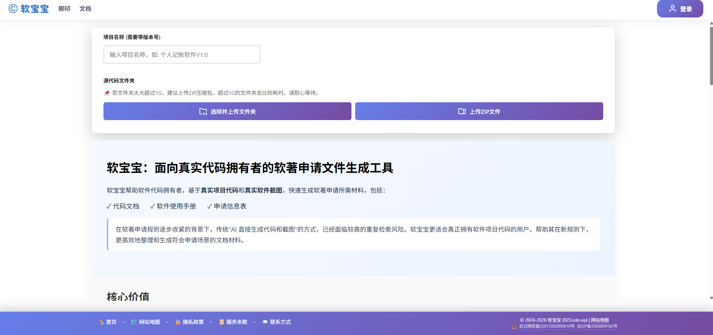
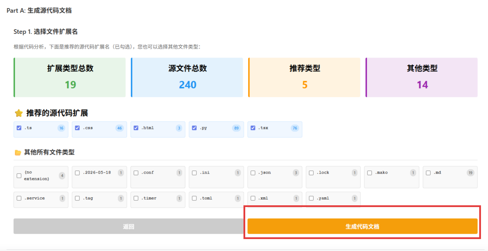

# 如何用软宝宝生成源代码文档

对于软件开发者来说，整理源代码文档一直是一件既耗时又容易出错的工作。

无论是：

- 软件著作权申请
- 项目交付
- 企业内部存档
- ISO/CMMI 等质量体系
- 高企、科小等项目申报

都需要一份规范的源代码文档。

软宝宝（RZCode.vip）可以帮助你几分钟内完成整个过程。

---

# 支持哪些方式？
目前上传源代码是不需要登录的，首页即能操作。
目前支持两种导入方式。

| 导入方式 | 推荐指数 | 说明 |
| -------- | -------- | ---- |
| ZIP 压缩包 | ⭐⭐⭐⭐⭐ | 推荐本地项目上传 |
| 本地源码目录 | ⭐⭐⭐⭐ | 适合开发中的项目 |

无论你的项目使用什么语言，都可以进行解析。

例如：

- Java
- C#
- Python
- Go
- Rust
- C/C++
- JavaScript
- TypeScript
- Vue
- React
- Angular
- Flutter
- Kotlin
- Swift

---

# 第一步：上传项目



进入首页。

点击 **上传**。

可以选择：

- 上传 ZIP
- 上传项目源码

上传完成后，系统会自动开始分析。分析时会有进度条提示进行到哪一步了。

真正需要打印的代码，其实只有业务代码。

软宝宝（RZCode.vip） 会自动过滤大量无意义文件，例如：

- node_modules
- vendor
- dist
- build
- .git
- .idea
- .vscode
- logs
- cache
- 临时文件

同时还会过滤：

- 图片
- 视频
- 字体
- 数据文件
- 编译产物

最终保留真正需要展示的源码。

这样既减少页数，又符合软件著作权提交要求。


---

# 第二步：智能识别项目


上传完成以后，RZCode 会自动识别项目文件后缀，判断文档的语言架构。

例如：

```
python
node.js
java
...
```

软宝宝支持总结如下信息：

- 项目语言
- 文件数量
- 总代码行数

无需任何配置。

---

# 第三步：下载源代码文档


* 系统会按照项目结构进行排序。

例如：

```
src
 ├── controller
 ├── service
 ├── entity
 ├── utils
 ├── config
 └── main
```

代码阅读顺序更加清晰。

不会出现文件杂乱的问题。

---

传统整理代码通常需要：

- 调整字体
- 修改页边距
- 控制每页行数
- 插入页码

软宝宝会自动完成这些工作。

默认生成：

- Courier New 字体
- 固定字号
- 每页约 50 行
- 一共60页的代码
- 自动分页
- 自动页码

生成后的文档更加规范。

---

# 常见问题

## 是否支持 GitHub？

暂不支持。

如有需求，我们后期可以持续开发。


---

## 是否支持几十万行代码？

支持。

系统会自动进行分块，优化上传效率。

对于超大型项目，也会自动过滤第三方依赖。

---

## 是否支持多种语言混合项目？

支持。

例如：

```
Vue + Java

React + SpringBoot

Flutter + Java

Python + Vue

Go + React
```

都可以正常解析。

---

## 是否会上传我的代码？

默认仅用于生成文档。

整个生成过程不会公开你的源代码。

如果部署企业版，还可以完全在企业内部服务器运行。

---

# 为什么不用复制粘贴？

很多开发者仍然采用：

1. 打开 IDE
2. 全选代码
3. 复制
4. 粘贴 Word
5. 调整格式
6. 调整分页
7. 修改字体
8. 删除无关文件

一个项目往往需要几个小时。

而软宝宝可以自动完成整个流程。

不仅速度更快，而且格式更加统一。

---

# 推荐使用场景

- 软件著作权申请
- 高企申报
- 科技项目申报

---

# 总结

源代码文档本不应该成为开发者的负担。

软宝宝(RZCode.vip)可以自动完成：

✅ 自动识别项目

✅ 自动过滤无关文件

✅ 自动整理目录结构

✅ 自动分页排版

✅ 自动生成 Word

让开发者把更多时间留给真正重要的事情——开发软件，而不是整理文档。
