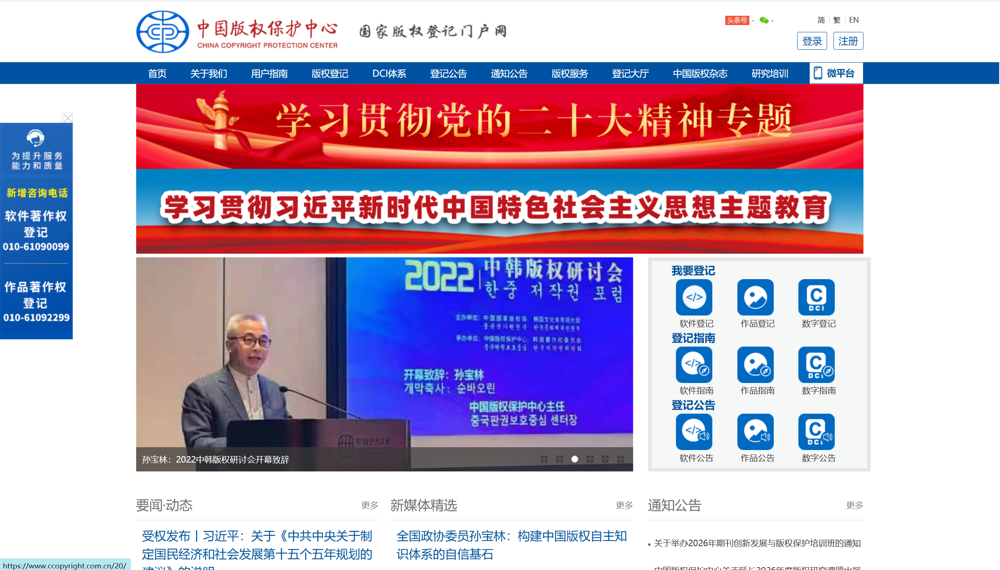
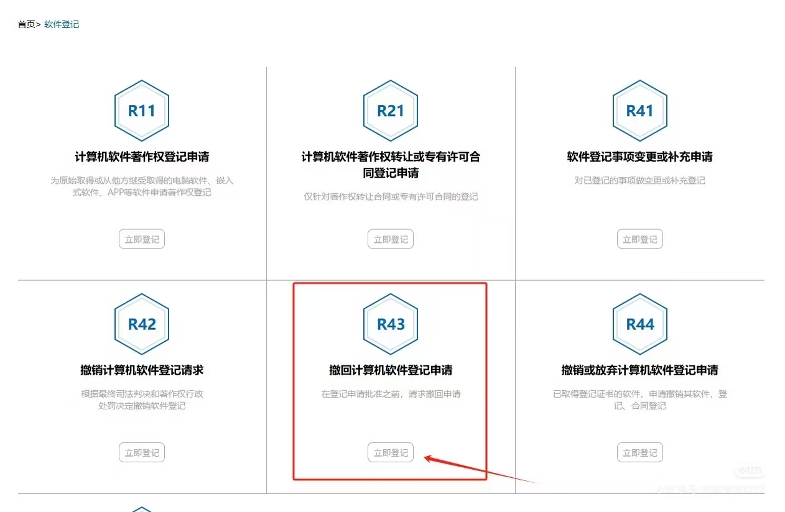
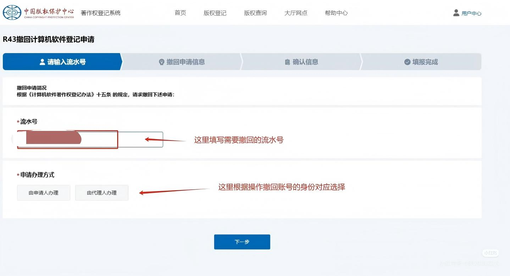
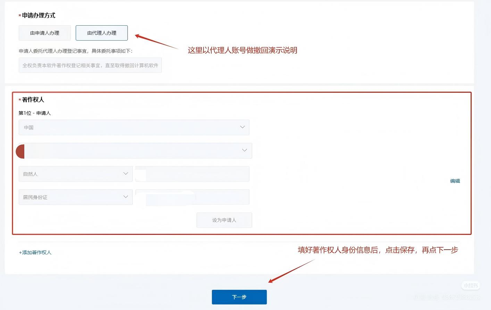
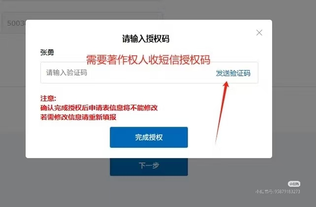
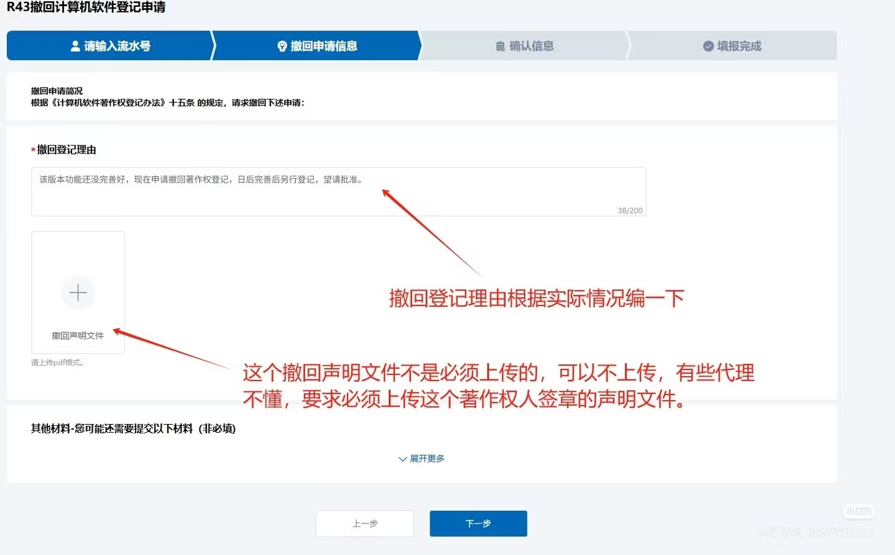
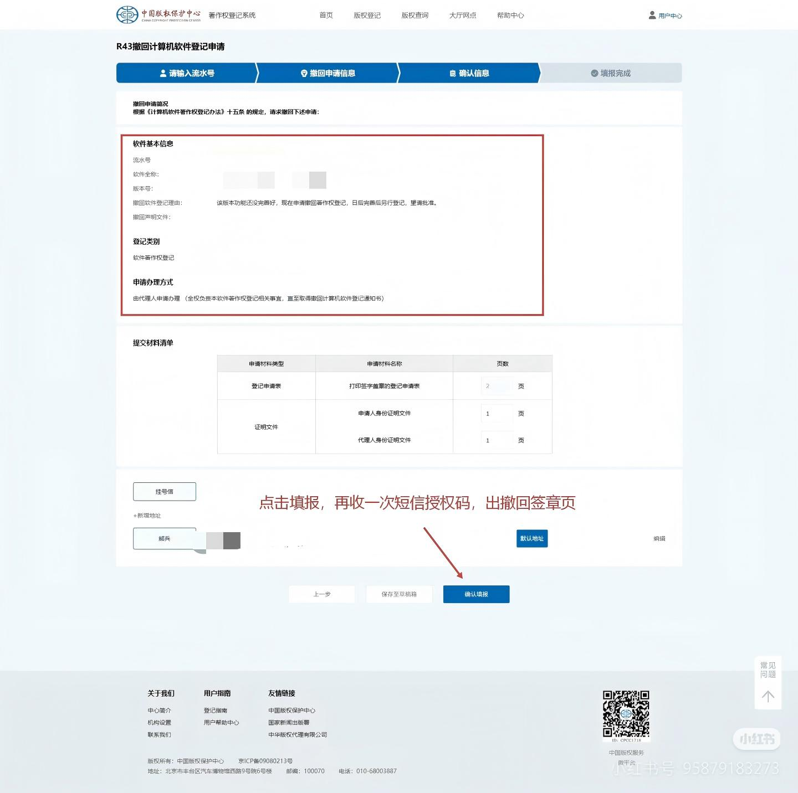
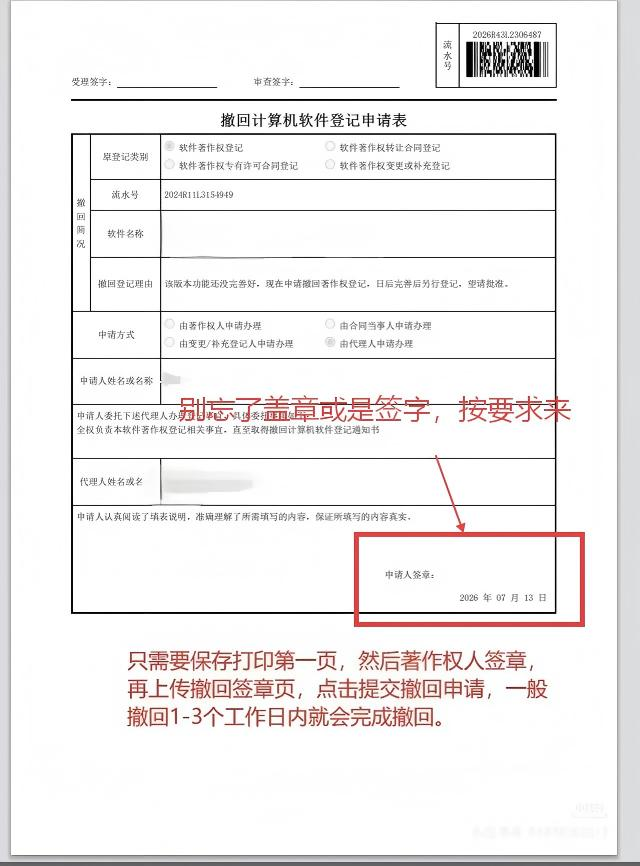
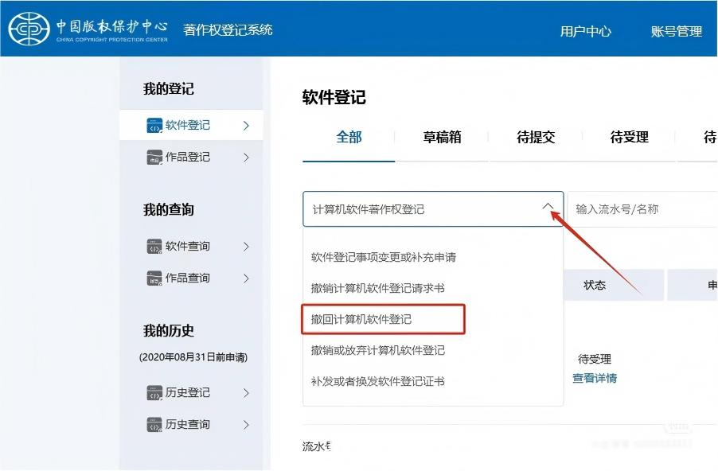

# 软著撤回流程步骤【图文详解】

软件著作权申请提交后，如果发现申请信息填写错误、材料存在问题，或者需要重新申请，可以通过版权保护中心在线提交**撤回申请**。

整个流程无需邮寄材料，正常情况下 **1～3 个工作日即可完成撤回**。

---

## 第一步：准备版权中心实名账号
首先需要准备一个**中国版权保护中心实名认证账号**。

支持两种方式：

- 使用著作权人自己的账号办理；
- 使用代理人或第三方账号办理。


> 📷 **图1：登录版权中心官网**


---

## 第二步：进入撤回申请入口

登录版权中心官网后，依次进入：

> **版权登记 → 软件登记 → 计算机软件著作权相关登记 → R43 撤回计算机软件登记申请**

进入后即可开始办理撤回业务。

> 📷 **图2：R43 撤回申请入口**


---

## 第三步：填写申请流水号

输入需要撤回的**软件著作权申请流水号**。

随后选择办理人身份：

- 申请人
- 代理人

本文以**代理人身份**进行演示。

> 如果使用申请人账号办理，会省去一次短信授权验证。

> 📷 **图3：填写流水号及办理人身份**

---

## 第四步：验证著作权人身份

填写著作权人的身份信息，包括：

- 姓名（或单位名称）
- 身份证号（统一社会信用代码）
- 联系方式

填写完成后：

1. 点击**保存**
2. 点击**下一步**
3. 系统发送短信验证码
4. 著作权人提供验证码
5. 完成身份核验

验证成功后，将进入撤回申请页面。

> 📷 **图4：填写著作权人信息**

> 📷 **图5：短信验证码验证**

---

## 第五步：填写撤回原因

填写撤回登记原因，例如：

- 申请信息填写错误
- 软件名称需要修改
- 著作权人信息有误
- 材料需重新整理后提交

填写完成后点击**下一步**即可。

> **注意：**
>
> **现在《撤回声明》文件不是必须上传，可以不动。**
>
> 很多人还在网上找撤回声明模板，其实最新版版权系统已经取消了该步骤。

> 📷 **图6：填写撤回理由**

> 📷 **图7：确认提交会再次要求输入验证码**

---

## 第六步：生成并签署撤回签章页

系统会再次发送短信验证码。

验证成功后，自动生成**撤回签章页**。

操作步骤：

1. 下载签章页；
2. 打印第一页；
3. 著作权人签字（单位盖章）。

> 📷 **图8：生成撤回签章页**

---

## 第七步：上传签章页

重新回到版权中心官网。

找到：

**撤回签章页上传入口**

新版版权系统进行了调整，需要：

1. 手动选择登记类型；
2. 找到对应的撤回申请；
3. 点击上传签章页；
4. 提交即可。

> 📷 **图9：上传签章页**

---

## 第八步：等待审核

提交成功后，版权中心一般会在：

> **1～3 个工作日**

完成撤回审核。

审核通过后，该软件著作权申请将正式撤回，可以重新提交新的申请。

---

# 注意事项

如果一个软件有**多个著作权人**，需要特别注意：

- 每位著作权人都需要完成短信授权；
- 每位著作权人都会收到 **2 次短信验证码**；
- 最终生成的撤回签章页需要**全体著作权人签字（或盖章）**；
- 所有签字完成后，再统一上传至版权中心官网。

否则，撤回申请将无法通过审核。

---

# 常见问题

## 一个软件可以撤回几次？

只要申请尚未完成登记，一般都可以提交撤回申请。

---

## 撤回后还能重新申请吗？

可以。

撤回成功后，可以修改软件名称、申请材料、著作权人信息等内容，再重新提交新的软件著作权申请。

---

## 撤回需要缴费吗？

目前版权中心在线办理撤回申请一般**无需额外缴费**。

---

## 撤回后多久可以重新申请？

通常撤回审核通过后，即可重新发起新的软件著作权申请，无需等待较长时间。

---

# 总结

软件著作权撤回流程并不复杂，总体分为以下 8 个步骤：

1. 准备版权中心实名认证账号；
2. 进入 **R43 撤回计算机软件登记申请**；
3. 填写申请流水号；
4. 验证著作权人身份；
5. 填写撤回原因；
6. 生成并签署撤回签章页；
7. 上传签章页；
8. 等待 1～3 个工作日完成撤回审核。

整个流程均可在线完成，最新版版权系统已经取消了上传《撤回声明》的要求，只需按流程完成身份验证和签章上传即可。
```
