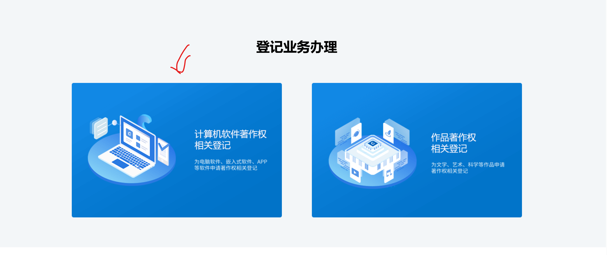
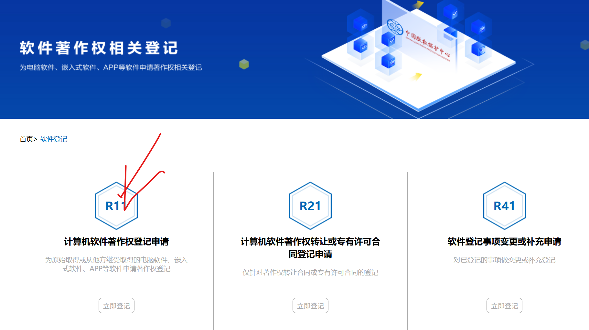
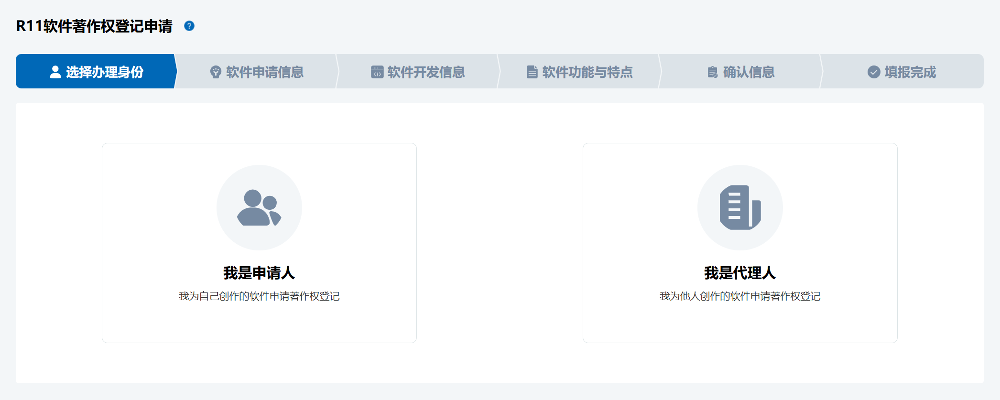
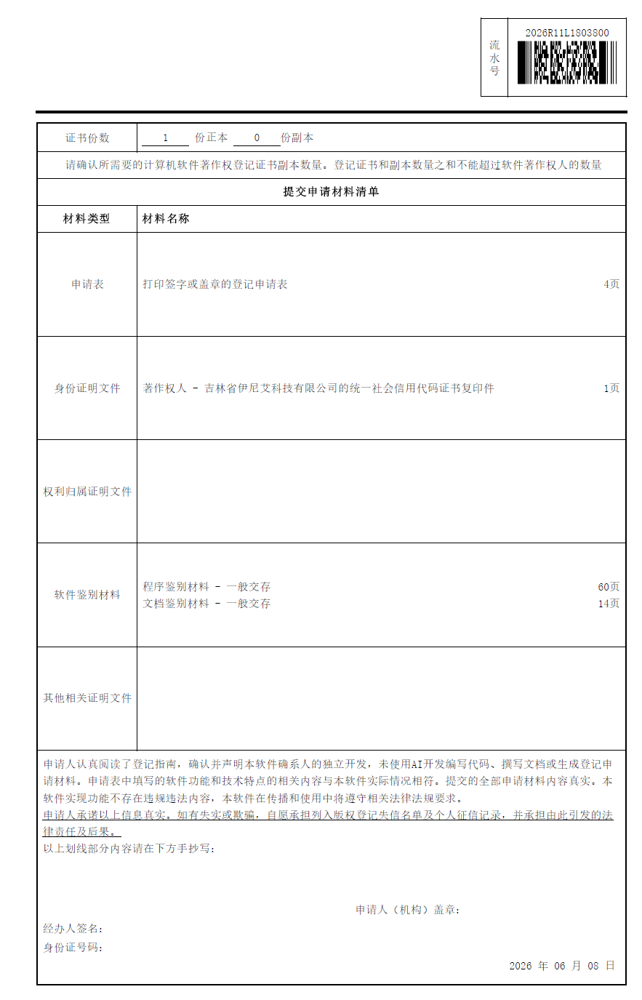
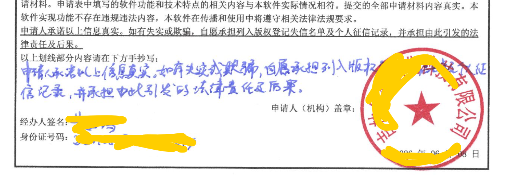
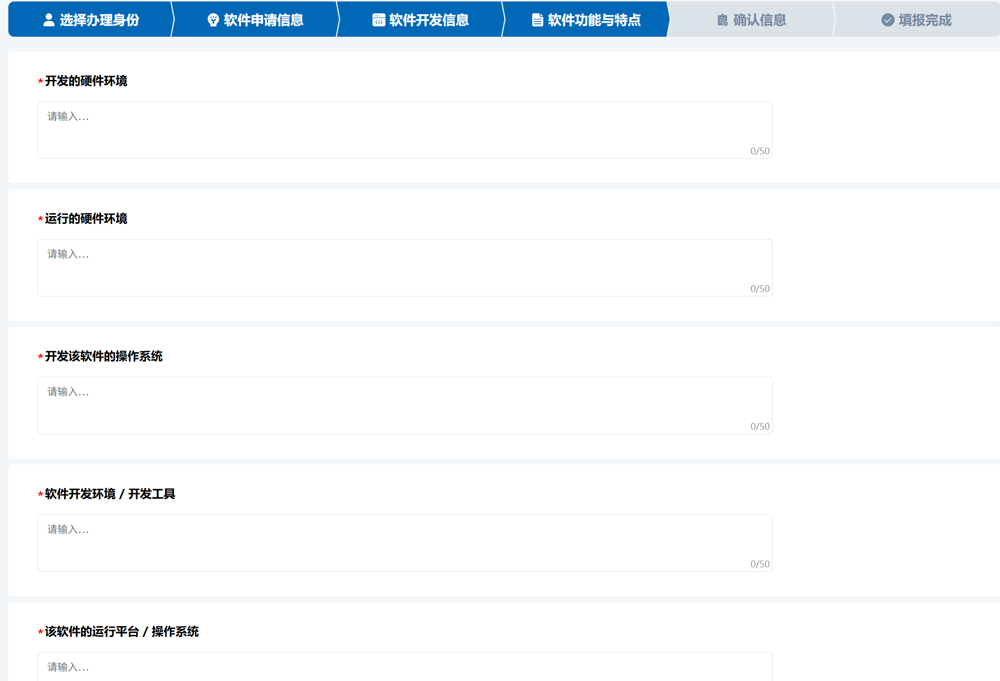
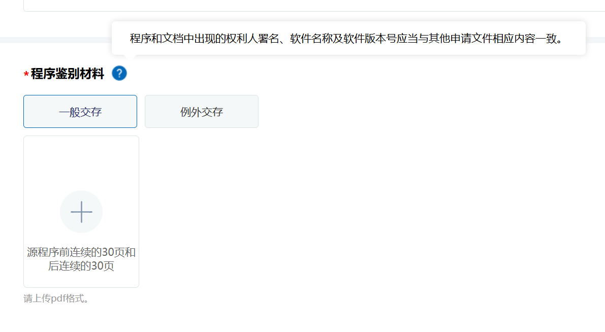
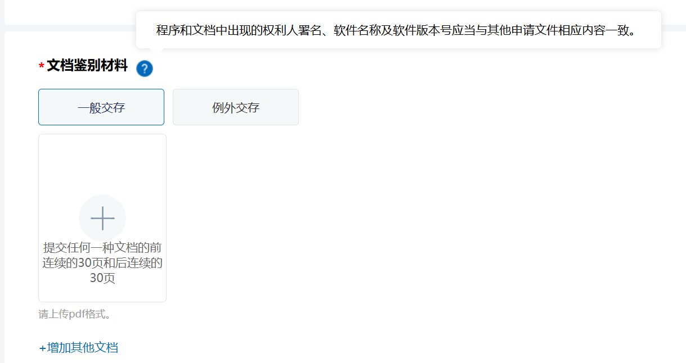

# 软件著作权申请全流程教程（2026最新版）

很多开发者第一次申请软件著作权（简称“软著”）时，都会觉得流程复杂、材料繁琐。

实际上，只要你拥有真实的软件产品，无论是网站、管理系统、APP、小程序、AI工具还是嵌入式程序，都可以申请软件著作权。

本文将用最简单的方式，教你怎样登记软件。软著审核时长，无补正则不到3个月。中间补正需要加一个月。

---

# 一、什么是软件著作权？

软件著作权是国家对软件开发者知识产权的一种保护。

简单理解：

你开发的软件，就像你写的一本书。

软件著作权证书就是国家给你开的“版权证明”。

虽然软件从开发完成时就自动拥有著作权，但获得软著证书后，可以在以下场景中发挥作用：

* 高新技术企业认定
* 科技项目申报
* 企业融资
* 招投标加分
* 产品知识产权保护
* 企业资产评估
* 双软认证
* 专利申请辅助证明

---

# 二、登记流程
> *如果没有账号，请参考[另一篇](./shenqing_zhanghao.md)*

## 1. 计算机软件著作权相关登记
登录进入首页后，下拉页面，点击左侧的大图标，

## 2. 点击计算机软件著作权登记申请
进入下一页后，点击R11项目，**计算机软件著作权登记申请**, 点击**立即登记**。

## 3. 根据申请表内容填写信息
这里面页面较多，但是比较重要的材料在[下个章节](#三申请软著需要准备什么)

## 4. 申请完需要完成签章页

## 5. 抄写一遍签章页上的句子
4项内容要检查好（个人不用盖章）：抄声明、法人名字、法人身份证号、盖章

## 6. 回到申请，上传签章页，完成🎉
---

# 三、申请软著需要准备什么？

主要需要三类材料：

## 1、软件基本信息

包括：

* 软件名称
* 版本号
* 开发完成日期
* 首次发表日期（可不发表）
* 软件运行环境
* 软件功能简介
...

例如：

软件名称：

《软宝宝软件著作权智能生成系统》

版本号：

V1.0

---

## 2、源代码

国家版权中心要求提交：

### 前30页代码

### 后30页代码

共60页。

要求：

* 每页50行以内
* 总计不少于3000行

如果项目代码不足3000行：

可以全部提交。

注意：

无需提交全部项目代码。

一般选择核心业务代码即可。

常见语言：

* Java
* Python
* Go
* PHP
* C#
* C++
* JavaScript
* TypeScript
* Rust
* mini program

都可以申请。

---

## 3、软件说明书

这是很多人最头疼的部分。

通常需要：

* 软件简介
* 功能介绍
* 系统架构
* 操作流程
* 软件截图
* 功能截图说明

一般要求：

15～30页左右。

很多申请被退回，并不是代码有问题，而是说明书和程序内容对不上。

---

# 三、如何准备说明书？

标准格式通常包含：

## 封面

软件名称

版本号

文档名称

用户操作手册或是功能介绍

---

## 软件简介

说明软件用途。

例如：

本系统是一套面向软件开发者的知识产权辅助工具，可自动分析项目代码结构，生成符合软件著作权申请要求的代码文档及使用说明材料。

---

## 运行环境

例如：

服务器环境：

* Ubuntu 20.04

开发语言：

* Python
* TypeScript

数据库：

* PostgreSQL

浏览器：

* Chrome
* Edge

---

## 功能模块

例如：

### 用户登录

支持账号密码登录。

### 项目管理

支持创建、编辑、删除项目。

### 代码分析

自动扫描代码目录。

### 文档生成

自动生成软著申请材料。

---

## 操作流程截图

建议按照顺序：

1. 登录系统
2. 创建项目
3. 上传代码
4. 配置参数
5. 开始生成
6. 下载文档

每个步骤配截图和文字说明。

---

# 四、提交方式

目前主要通过中国版权保护中心系统提交。账号一般会有申请人的信息。

申请人可以是：

* 个人
* 公司
* 高校
* 研究机构

提交后需要打印签证页。

---

# 五、审查周期

普通申请：

约2～4个月。

加急申请：
和普通申请相比，一般要少一周左右的时间。

---

# 六、常见退回原因

## 代码重复率过高

大量模板代码。

大量自动生成代码。

核心业务逻辑过少。

---

## 软件截图不足

无法体现软件实际功能。

只有登录页面。

没有业务流程展示。

---

## 软件名称不规范

例如：

错误：

* OA系统
* 管理平台

正确：

* XX企业智能办公管理系统
* XX数据治理平台

---

## 说明书过于简单

只有几页内容。

没有功能描述。

没有操作流程。

---

# 七、如何提高通过率？

建议做到：

✓ 软件真实存在

✓ 软件能够运行

✓ 有完整功能截图

✓ 提供核心业务代码

✓ 说明书逻辑清晰

✓ 软件名称规范

✓ 版本号规范

通常一次通过问题不大。

---

# 八、现在有没有更简单的方法？

有。

传统方式需要：

* 手工整理代码
* 手工截图
* 手工编写说明书
* 手工排版

整个过程往往需要数小时甚至数天。

现在已经可以通过智能工具自动完成。

例如：

1. 上传项目源码
2. 自动筛选核心代码
3. 自动生成60页代码文档
4. 上传软件运行截图
5. 自动识别软件功能
6. 自动生成软著说明书

原本需要数小时完成的工作，几分钟即可完成。

对于个人开发者、创业团队、软件公司以及知识产权代理机构来说，可以显著提高软著申报效率。

---

# 总结

申请软件著作权其实并不难。

核心就三件事：

1. 准备代码
2. 准备软件截图
3. 生成规范说明书

只要软件真实存在，并且能够体现核心功能，大多数项目都具备申请软件著作权的条件。

对于企业而言，软著不仅是一张证书，更是企业知识产权体系建设的重要组成部分。
