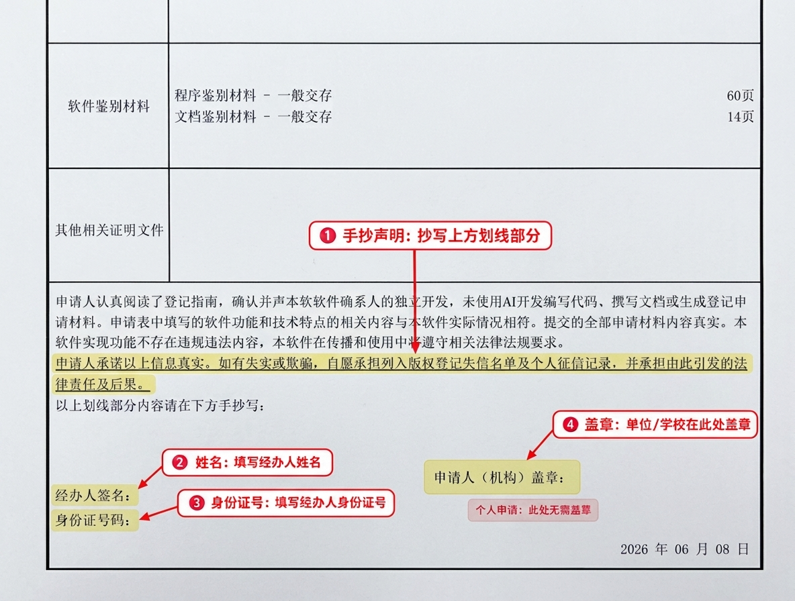

申请软件著作权时，签章页是需要认真填写的材料之一。个人申请和单位、学校申请的填写要求有所不同。如果是合作开发的软件，也需要注意应该由谁填写和盖章。

本文整理了软著签章页的填写方法，帮助你快速完成材料准备。

## 一、个人申请：填写 3 处

如果软件著作权的申请人是个人，签章页需要填写以下三项：

1. **手抄声明**：按照签章页上的声明原文，使用手写方式抄写。
2. **姓名**：填写申请人的真实姓名。
3. **身份证号**：填写申请人的身份证号码。

个人申请不需要盖章。

### 个人填写注意事项

- 手抄声明应与原文一致，不要自行修改或遗漏文字。
- 姓名应与申请材料中的申请人姓名保持一致。
- 身份证号码应准确无误，填写前建议仔细核对。
- 手写内容应清晰、完整，避免字迹潦草、涂改或内容超出指定区域。

## 二、单位或学校申请：需要填写 4 处

如果软件著作权的申请人是公司、企业、学校或其他单位，签章页需要完成以下四项：

1. **手抄声明**：由相关签署人员按照原文手写声明。
2. **姓名**：填写实际签署人的姓名。
3. **身份证号**：填写实际签署人的身份证号码。
4. **盖章**：在指定位置加盖申请单位或学校的印章。

### 单位或学校填写注意事项

- 手抄声明必须清晰、完整。
- 姓名和身份证号码应填写实际签署人的信息。
- 应在指定位置加盖申请单位或学校的印章，确保印章清晰、完整。
- 盖章前检查手写内容是否填写完整，避免遗漏后反复打印。

**特别提醒：** 应该由账号申请的主体关联人抄写、签名及填写身份证号码。

## 三、合作开发的软件，其他合作者需要签章吗？

合作开发的软件，只需操作的申请人或是代理人一人处理签章页即可，签章页会和申请者账号类型一致。

**一般处理原则：按照申请人的性质准备相应的签章材料。**

- **申请人为个人**：按照个人申请的要求填写签章页。
- **申请人为单位或学校**：按照单位或学校申请的要求填写签章页。

## 四、签章页提交前检查清单

提交之前，可以按照以下清单逐项检查：

- [ ] 手抄声明已按原文完整抄写。
- [ ] 姓名填写正确。
- [ ] 身份证号码准确无误。
- [ ] 单位或学校申请已按要求加盖印章。
- [ ] 手写字迹清晰，内容没有缺漏。
- [ ] 印章清晰完整，没有明显遮挡文字。
- [ ] 合作开发软件的申请人信息与签章材料一致。
- [ ] 已按照当前申请渠道的要求检查签章页格式及提交方式。

## 五、常见问题

### 1. 手抄声明可以打印吗？

如果签章页明确要求手抄声明，应按要求手写，不要直接打印声明文字代替。

### 2. 字迹不太好看，会影响申请吗？

重点是清晰、可辨认、内容完整。建议使用书写清楚的字体，避免连笔过多或字迹过于潦草。

### 3. 单位申请只盖章，不写姓名和身份证号可以吗？

不建议遗漏。单位或学校申请通常需要完成手抄声明、姓名、身份证号码和盖章四项，应按照签章页上的要求逐项填写。

### 4. 合作开发的软件，所有合作者都要签字吗？

不需要。应根据登记申请中列明的申请人及具体签章要求办理。

---

## 总结

软著签章页的填写并不复杂，关键是区分申请人类型：

- **个人申请：** 手抄声明、姓名、身份证号，共 3 处。
- **单位或学校申请：** 手抄声明、姓名、身份证号、盖章，共 4 处。
- **合作开发申请：** 根据实际申请人的性质及受理要求准备签章材料，其他著权人不需要签署签章页。

填写完成后，建议再检查一遍手写内容、身份信息和印章，确保材料清晰、完整。

