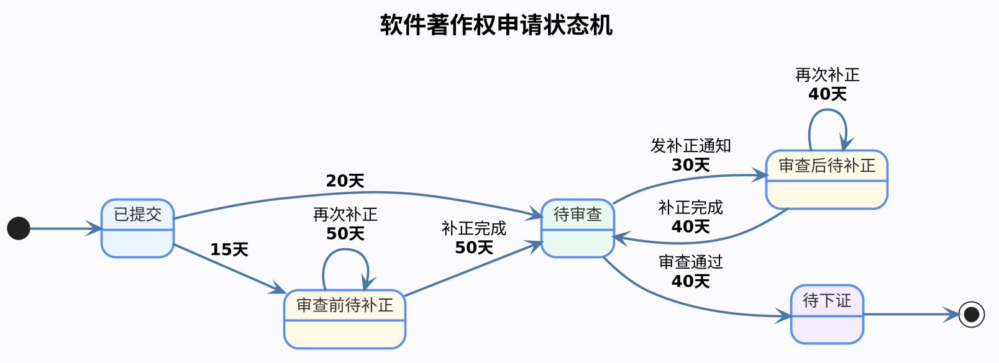

软件著作权（软著）申请并不是简单地提交材料后等待下证，而是一个存在多个审核节点和补正环节。了解整个流程，有助于申请人合理安排时间，提高申请成功率。

> **注意：** *这个图的时间线都是大致的时间，仅作参考*


---

## 软件著作权申请流程图

> 整个流程可以概括为：

```text
已提交
   │
   ├──20天──► 待审查
   │              │
   │              ├──40天──► 待下证
   │              │
   │              └──30天──► 审查后待补正
   │                             │
   │                        补正40天
   │                             ▼
   │                         返回待审查
   │
   └──15天──► 审查前待补正
                  │
             补正50天
                  ▼
               返回待审查
```

> 如果补正材料仍存在问题，则可能再次进入补正状态，形成循环，直到满足审查要求。

---

# 一、已提交

申请材料成功提交至版权保护中心后，状态显示为**已提交**。

此时主要有两种走向：

## 情况一：正常进入待审查

一般约 **20天** 左右进入：

```
已提交
    │20天
    ▼
待审查
```

这是最理想的情况。

---

## 情况二：审查前发现材料存在问题

提交后约 **15天** 左右，工作人员可能发现：

- 材料缺失
- 文档格式错误
- 身份证明问题
- 申请信息填写错误
- 其他明显问题

此时状态变为：

```
已提交
   │15天
   ▼
审查前待补正
```

---

# 二、审查前待补正

这是**正式进入审查之前**的补正。

收到补正通知后，需要在规定时间内完成补正。

完成补正后：

```
审查前待补正
      │
补正完成（约50天）
      ▼
    待审查
```

---

## 如果补正仍然不符合要求

系统可能再次进入：

```
审查前待补正
      ▲
      │
再次补正（约50天）
      │
      ▼
审查前待补正
```

因此，这个状态可能循环多次。

只有补正符合要求后，才能正式进入待审查。

---

# 三、待审查

进入待审查说明：

- 材料已经符合基本要求
- 正在进入正式审查阶段

接下来有两种结果。

---

## 情况一：审查通过

正常审核约 **40天**：

```
待审查
   │40天
   ▼
待下证
```

这是最顺利的流程。

---

## 情况二：审查过程中要求补正

审查人员认为：

- 功能描述不清晰
- 软件说明书存在问题
- 源代码存在问题
- 权利归属证明不足
- 其他需要进一步说明的问题

一般约 **30天** 左右发出补正通知：

```
待审查
   │30天
   ▼
审查后待补正
```

---

# 四、审查后待补正

这是正式审查过程中发出的补正通知。

申请人需要根据补正意见修改材料。

完成补正后：

```
审查后待补正
      │
补正完成（约40天）
      ▼
    待审查
```

系统重新进入待审查。

---

## 可能再次补正

如果修改后的材料仍存在问题，则可能再次进入：

```
审查后待补正
      ▲
      │
再次补正（约40天）
      │
      ▼
审查后待补正
```

因此，一个申请可能经历多轮补正。

---

# 五、待下证

待审查通过后：

```
待审查
   │40天
   ▼
待下证
```

说明：

- 已通过审查
- 正在制作证书
- 等待发放电子证书

此阶段一般无需申请人操作。

随后流程结束。

```
待下证
   │
   ▼
完成
```

---

# 各状态预计时间汇总

| 状态转换 | 预计时间 |
|-----------|----------|
| 已提交 → 待审查 | 约20天 |
| 已提交 → 审查前待补正 | 约15天 |
| 审查前待补正 → 待审查 | 补正约50天 |
| 审查前待补正 → 审查前待补正 | 再次补正约50天 |
| 待审查 → 审查后待补正 | 发补正通知约30天 |
| 审查后待补正 → 待审查 | 补正约40天 |
| 审查后待补正 → 审查后待补正 | 再次补正约40天 |
| 待审查 → 待下证 | 审查通过约40天 |

---

# 为什么申请时间差异很大？

很多申请人发现，有的人两个月左右就拿到证书，而有的人需要四五个月，甚至更长。

主要原因在于是否进入了补正流程。

- **未补正**：已提交 → 待审查 → 待下证，流程较快。
- **审查前补正**：增加至少约50天，并可能多次循环。
- **审查后补正**：每轮补正增加约40天，也可能反复补正。

因此，**申请材料质量越高、说明书越规范、源代码越完整，进入补正的概率越低，整体办理时间也越短。**

---


## 如何判断自己的软著大概率已经通过？

很多申请人在进入**待审查**后，最关心的问题就是：

> **我的软著是不是快通过了？**

根据大量申请案例观察，有一个比较明显的经验规律：

> **如果你的待审查时间已经接近正常下证时间（约40天），尤其是在预计进入待下证前的一周左右，仍然没有收到任何补正通知，那么通过的概率通常会大幅提高。**
